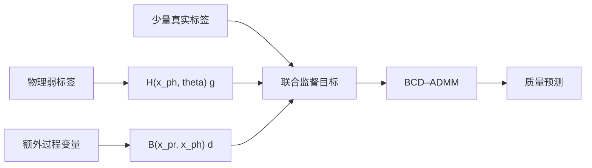

# PWL 项目概览

> **历史概览：以下表格为 S1 之前的开发结果。** 最新状态见 [当前有用内容与后续主线](CURRENT_STATUS.md)。
> S1 新批次中 A4 优于 PWL（@120：4.727 vs 5.449 K）；下文“12/12 均值最优”只针对当时的对照模型集合。

> 面向浏览、答辩和 GitHub 展示的项目入口。技术细节、限制条件与完整证据均链接
> 到仓库内可复核文档，避免把阶段性均值结果表述为普适结论。

## 项目定位

本项目实现了一套物理知识学习（Physics-Informed Weakly-Supervised Learning，
PWL）框架，将低成本物理模型、少量真实标记数据和额外过程变量统一为：

\[
\hat y = H(x^{ph},\theta)g + B(x^{pr},x^{ph})d.
\]

- `H g`：从物理弱标签中蒸馏可复用规律；
- `B d`：补偿低保真模型遗漏的过程效应和结构偏差；
- `theta`：弱标签校准与预测辅助参数；
- BCD–ADMM：联合求解稀疏系数、差异系数和校准参数。

PWL 是**可实例化的建模框架**，不是跨场景即插即用的固定模型。算法内核可以
复用，新场景仍必须重新设计物理模型、`H/B` 基函数和可识别性判据。

## 架构



```text
pwl_repro.core          通用模型、特征注册与优化器
├── pwl_repro.scenarios 论文仿真与案例 B
├── pwl_repro.experiments
│                        调参、协议、统计与报告
└── pwl_migration       热传导迁移场景
```

详细依赖规则见[项目架构](ARCHITECTURE.md)。

## 当前可展示结果

热传导 v3 主模型使用两列低保真侧可计算的接触机理特征、refresh 弱标签和
场景化 minimum 规则。20 批统计终态如下：

| 模型 | @10 RMSE | @60 RMSE | @120 RMSE |
|---|---:|---:|---:|
| **PWL** | **7.678** | **5.825** | **5.351** |
| Physics-GP | 8.870 | 6.540 | 5.648 |
| GP | 10.759 | 6.146 | 5.680 |
| GBDT | 10.908 | 6.938 | 6.338 |
| PhysicsDirect | 15.275 | 15.275 | 15.275 |

- 12/12 标签档的均值结果均为 PWL 最优；
- @120 的 PWL–Physics-GP 均值差为 −0.297 K；
- 95% CI 为 [−0.624, 0.030]，Cohen `dz≈−0.43`；
- 单侧 `p=0.036`，Holm 校正后 `p=0.071`。

因此允许的终态表述是：

> PWL 在当前 20 批协议下保持均值优势趋势，但尚无充分的校正后统计显著性证据。

完整统计见[20批统计闭环报告](../migration/reports/迁移后续工作/COMSOL场景20批统计闭环报告.md)。

## 机制消融

| 消融 | 关键变化 | 支持的结论 |
|---|---:|---|
| 无 B | @120：5.366 → 8.047 | 差异补偿承担大样本结构偏差 |
| 无弱标签 | @10：8.055 → 10.355 | 物理蒸馏主要贡献小样本优势 |
| 去两列 qint 机理特征 | @120：5.366 → 5.548 | 机理列使均值结果由落后转为领先 |
| n_weak 50→100→200 | @10：8.571→8.118→8.055 | 弱标签收益约在 100 条后饱和 |

完整对照见[v3机制消融报告](../migration/reports/迁移后续工作/COMSOL场景v3机制消融报告.md)。

## 工程与验证

- 57 项单元/回归测试通过；
- 30 项独立仿真数值检查通过；
- 热传导数据 20/20 批通过有限性、哈希、覆盖、噪声、相关性与隔离验收；
- v3 基线具有配置指纹、数据哈希、依赖锁和独立复核记录；
- GitHub Actions 执行 pytest、独立验证及两条业务线 smoke。

## 最小复现

```powershell
uv sync --python 3.11 --extra dev
uv run pytest
uv run python reproduction/scripts/verify_sim_correctness.py
uv run python reproduction/run_reproduction.py `
  --config reproduction/configs/smoke.yaml `
  --output reproduction/results/smoke
uv run python migration/run_migration.py `
  --config migration/configs/heat_smoke.yaml `
  --output migration/results/heat_smoke_check
```

## 结论边界

当前项目可以展示算法工程化、场景迁移方法、热传导均值结果和独立机制证据，
但不应宣称：

- 已严格复现论文所有数值；
- PWL 在所有场景普遍优于其他模型；
- 热传导优势已经通过校正后显著性门槛；
- `theta` 等于可可靠恢复的真实材料热导率；
- 热传导 `H/B` 可以直接复制到其他工业过程。

## 导航

- [阶段性总结](../阶段性总结_PWL算法实现框架.md)
- [当前必须项目与实施方案](../PWL当前必须项目与实施方案.md)
- [论文复现说明](../reproduction/REPRODUCTION.md)
- [热传导迁移说明](../migration/README.md)
- [v3事实基线卡](../migration/results/heat_v3_qint_min/BASELINE.md)
- [theta判据修订](../migration/reports/迁移后续工作/COMSOL场景theta判据修订.md)
